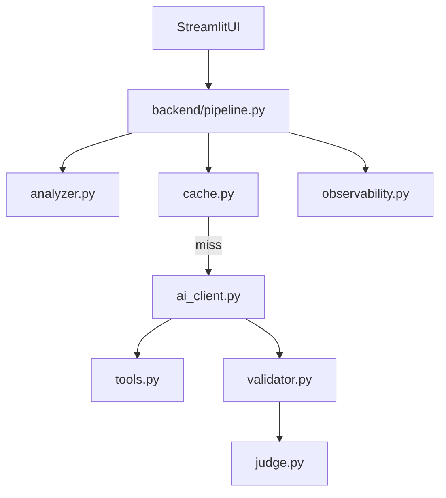

# Smart Log Analyzer & Self-Healing Service

[](https://huggingface.co/spaces/YOUR_USERNAME/smart-log-healer)

An automated backend utility that intercepts server exceptions, clusters duplicate crash signatures, generates AI patches with tool-based context retrieval, validates fixes with real `pytest` subprocesses, and gates output through an LLM-as-a-Judge review layer.

## Problem

Production services generate repeating crash logs. Manually debugging each trace is slow, and sending every near-duplicate error to an LLM wastes rate limits and money.

## Solution

This project implements a multi-stage self-healing pipeline:

1. Parse stack traces with regex (`O(N)`)
2. Normalize and cluster signatures with a custom Levenshtein DP engine (`O(M×N)`)
3. Reuse cached fixes on cache hits (`>= 85%` similarity)
4. On cache miss, call Groq/Llama with `read_file_lines` tool-calling (acceptance tests included in prompt)
5. Validate patches in an isolated temp directory via real `pytest`
6. On pytest failure, retry patch generation once with test output as feedback
7. Run an LLM-as-a-Judge security/logic review (skipped on cache hits)
8. Trace LLM calls with Langfuse (optional)

## Architecture



## Algorithms used

| Component | Technique |
|-----------|-----------|
| Trace parsing | Regex scanner, linear time |
| Log clustering | Custom Levenshtein dynamic programming |
| Patch diff UI | `difflib.unified_diff` (LCS-based) |
| Cache | In-memory hash map |
| Pipeline | Linear DAG of stages |

## Tech stack

- Python 3.11+
- Streamlit
- Groq API (`llama-3.3-70b-versatile`)
- pytest
- Langfuse (optional)
- Hugging Face Spaces (deployment target)

## Local setup

```bash
git clone <your-repo-url>
cd smart-log-healer
python -m venv .venv
source .venv/bin/activate
pip install -r requirements.txt
```

**Groq API key** (pick one):

```bash
# Option A: environment variable (recommended for local pytest + Streamlit)
cp .env.example .env   # optional template
export GROQ_API_KEY="your_key"
streamlit run app.py
```

```toml
# Option B: .streamlit/secrets.toml (Streamlit + backend pipeline both read this)
GROQ_API_KEY = "your_key"
```

The backend resolves `GROQ_API_KEY` from the environment first, then from `.streamlit/secrets.toml`, so you do not need both.

Optional observability:

```bash
export LANGFUSE_PUBLIC_KEY="..."
export LANGFUSE_SECRET_KEY="..."
```

Add the same keys to HF Space secrets or `secrets.toml` when deploying. After a pipeline run, open the **View LLM Trace** link in the UI (or your Langfuse project) to inspect latency and token usage.

## Run tests

```bash
pytest tests/ -v
```

CI uses mocked AI calls only — no paid API usage on every push.

## Hugging Face Spaces deployment (recommended)

Free CPU hosting, built for Streamlit, matches this repo layout. **Total cost: $0** with Groq free tier.

### Prerequisites

| Item | Where |
|------|--------|
| [Hugging Face](https://huggingface.co/join) account | Sign up |
| [Groq](https://console.groq.com) API key | Required for AI |
| GitHub account (optional) | Easiest way to connect the Space to your code |

### Option A — Deploy from GitHub (best for updates)

**1. Push code to GitHub**

```bash
cd smart-log-healer
git init   # if not already a repo
git add app.py backend/ data/ sandbox/ tests/ requirements.txt runtime.txt README.md .env.example .gitignore pytest.ini
git commit -m "Initial commit: Smart Log Healer"
# Create empty repo on GitHub, then:
git remote add origin https://github.com/YOUR_USER/smart-log-healer.git
git branch -M main
git push -u origin main
```

Do **not** commit `.streamlit/secrets.toml`, `.env`, or `.venv/` (already in `.gitignore`).

**2. Create the Space**

1. Go to [huggingface.co/new-space](https://huggingface.co/new-space)
2. **Space name:** `smart-log-healer` (or your choice)
3. **License:** MIT (or your preference)
4. **Select SDK:** **Streamlit**
5. **Space hardware:** **CPU basic** (free tier is enough; pipeline runs pytest + Groq API calls)
6. **Create Space**

**3. Connect GitHub**

1. In the Space, open **Files and versions** → **Add file** → **Link GitHub repository** (or Settings → Repository → connect repo)
2. Select your `smart-log-healer` repo and branch `main`
3. HF builds automatically from `requirements.txt` and runs `streamlit run app.py`

**4. Add secrets (required)**

Space → **Settings** → **Repository secrets** (or **Variables and secrets**):

| Secret name | Value |
|-------------|--------|
| `GROQ_API_KEY` | `gsk_...` from Groq console |

Optional (Langfuse tracing):

| `LANGFUSE_PUBLIC_KEY` | `pk-lf-...` |
| `LANGFUSE_SECRET_KEY` | `sk-lf-...` |

HF exposes these as **environment variables**; the backend reads `GROQ_API_KEY` from the environment.

**5. Restart / rebuild**

After adding secrets: **Settings** → **Factory rebuild** (or push a small commit to trigger rebuild).

**6. Open your app**

`https://huggingface.co/spaces/YOUR_HF_USER/smart-log-healer`

Set the Space to **Public** if you want a shareable portfolio link.

---

### Option B — Upload directly to Hugging Face (no GitHub)

1. Create a Streamlit Space as in Option A step 2
2. Upload project files via the web UI (or `git clone` the Space repo HF gives you and push files)
3. Ensure root contains: `app.py`, `requirements.txt`, `backend/`, `data/`, `sandbox/`
4. Add `GROQ_API_KEY` in Space secrets
5. Wait for build to finish

---

### Verify deployment

1. Sidebar shows **Groq API: configured**
2. Run **Database Null Pointer (NoneType)** → pipeline completes, pytest result shown
3. Run **Cache Demo** scenario after a successful first run → cache hit

### HF troubleshooting

| Issue | Fix |
|-------|-----|
| Build fails on `requirements.txt` | Check build logs; ensure `runtime.txt` says `python-3.11` |
| `GROQ_API_KEY is not set` | Add secret in Space settings; rebuild |
| App sleeps / slow first load | Free tier cold start; wake by opening the URL |
| Cache resets | Expected on HF restart (in-memory cache) |
| Build timeout | Free tier limits; keep repo lean (no `.venv` in git) |

---

## Streamlit Community Cloud (alternative)

1. Push repo to GitHub (same as Option A step 1)
2. [share.streamlit.io](https://share.streamlit.io) → **New app**
3. Repo, branch `main`, main file `app.py`
4. **Advanced settings** → Secrets:

```toml
GROQ_API_KEY = "gsk_..."
```

5. Deploy. The repo includes `.python-version` (`3.12`) so Cloud does not use Python 3.14 (which breaks `pydantic` install).

---

## What gets deployed

| Included | Not deployed |
|----------|----------------|
| Streamlit UI (`app.py`) | Your local `.venv` |
| `backend/` pipeline | `.streamlit/secrets.toml` (use host secrets) |
| `sandbox/` scenarios + pytest | Local-only cache (resets on restart) |
| `data/scenarios.json` | |

External services at runtime: **Groq API** (required), **Langfuse** (optional).

---

## Short checklist

- [ ] Code on GitHub (or uploaded to HF)
- [ ] HF Space SDK = Streamlit, `app.py` at repo root
- [ ] `GROQ_API_KEY` in Space secrets
- [ ] Build succeeded (green)
- [ ] Public URL works and one scenario runs end-to-end

## Demo flow

1. Run **Database Null Pointer (NoneType)** — cache miss, AI patch (with test-aware prompt), pytest, judge
2. Run **Same Error, Different Request ID (Cache Demo)** — cache hit, AI skipped, judge skipped
3. Use **Custom stack trace** in the sidebar to vary `request_id` while keeping the same bug
4. Open the Langfuse trace link to inspect token usage and latency (if configured)

## Guardrails

- Patches are written only inside per-run temp directories
- Real `pytest` subprocess captures `stdout`, `stderr`, and exit codes
- Cache stores fixes only after pytest pass and judge approval
- No auto-merge or GitHub PR creation in v1

## Limitations

- Mock scenarios only (no live production webhook yet)
- In-memory cache (Redis recommended for production)
- Docker-in-Docker is not used on HF free tier; subprocess isolation is the deliberate v1 trade-off
- GitHub PR creation is Phase 2

## Cost

- Groq free tier for patch generation and judge review
- Langfuse hobby tier for tracing
- Hugging Face Spaces free CPU tier for hosting

Total build and demo cost: **₹0** with free-tier services.

## Resume bullets

- Architected a multi-stage self-healing pipeline in Python that parses stack traces, retrieves code context via LLM function calling, and validates AI patches through isolated pytest subprocesses and an LLM-as-a-Judge security gate.
- Implemented a custom Log Signature Clustering engine using Dynamic Programming (Levenshtein edit distance) to deduplicate crash traces and skip redundant LLM calls on similar errors.
- Integrated Langfuse observability to trace per-run LLM latency, token usage, and prompt-response paths on a zero-cost Groq/Llama inference stack.
