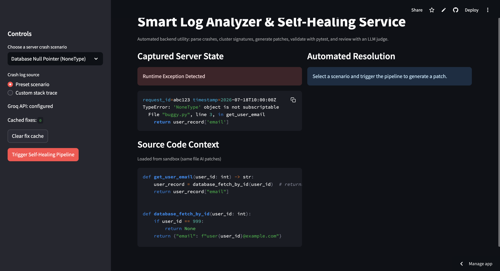
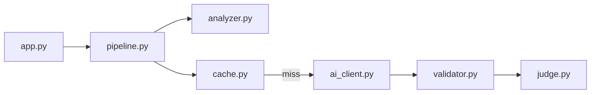

# Smart Log Healer

Automated crash analysis and patch proposal for Python backend errors. The Streamlit app parses stack traces, clusters similar signatures, generates fixes via Groq (Llama 3.3 70B), validates patches with real `pytest` runs, and optionally reviews them with an LLM judge. Cached fixes skip repeat AI calls for near-duplicate crashes.



## How it works

1. **Parse** — Extract error type, message, file, and line from a stack trace.
2. **Normalize** — Strip volatile fields (request IDs, timestamps) to build a stable signature.
3. **Cache** — On high similarity to a prior signature, return a validated fix without calling the model.
4. **Generate** — On cache miss, propose a full-file patch with acceptance tests in the prompt; retry on pytest failure or incomplete files.
5. **Validate** — Run scenario `test_buggy.py` in an isolated temp directory.
6. **Judge** — Second LLM pass for security and logic (skipped on cache hits).

Optional: Langfuse tracing when keys are configured.

## Architecture



## Tech stack

Python 3.11+, Streamlit, Groq API, Pydantic, pytest, Langfuse (optional).

## Local setup

```bash
git clone https://github.com/MuskanKumari2023/smart-log-healer.git
cd smart-log-healer
python -m venv .venv
source .venv/bin/activate   # Windows: .venv\Scripts\activate
pip install -r requirements.txt
```

**Groq API key** ([console.groq.com](https://console.groq.com)) — use one of:

```bash
export GROQ_API_KEY="gsk_..."
streamlit run app.py
```

Or create `.streamlit/secrets.toml` (do not commit):

```toml
GROQ_API_KEY = "gsk_..."
```

Resolution order: environment variable → Streamlit secrets (Cloud) → `.streamlit/secrets.toml`.

**Tests:**

```bash
pytest tests/ -v
```

CI uses mocked AI calls; no Groq usage on every push.

## Deploy on Streamlit Community Cloud

1. Push this repository to GitHub (`main`, entrypoint `app.py` at repo root).
2. Open [share.streamlit.io](https://share.streamlit.io) → **Create app** → select the repo, branch `main`, main file `app.py`.
3. **Advanced settings → Secrets:**

```toml
GROQ_API_KEY = "gsk_..."
```

4. **Advanced settings → Python version:** **3.12** (recommended). Community Cloud does not use `runtime.txt` or `.python-version`; set the version in the UI. If the build uses Python 3.14, delete the app and redeploy with 3.12 selected, or rely on current `requirements.txt` (Pydantic 2.13+ ships wheels for 3.14).
5. Deploy, then **Reboot** after changing secrets.

**Verify:** Sidebar shows **Groq API: configured**. Run **Database Null Pointer (NoneType)** and confirm pipeline stages, pytest result, and proposed patch.

**Secrets on Cloud:** Use the dashboard only — not a committed `secrets.toml`.

**Throttling:** Free tier may temporarily limit CPU after heavy rebuilds; the app still runs but can feel slower until the limit expires.

## Optional: Langfuse

```bash
export LANGFUSE_PUBLIC_KEY="pk-lf-..."
export LANGFUSE_SECRET_KEY="sk-lf-..."
export LANGFUSE_HOST="https://cloud.langfuse.com"
```

On Streamlit Cloud, add the same keys in **Secrets**. The UI shows a trace link when a run is traced.

## Demo scenarios

| Scenario | What to observe |
|----------|-----------------|
| Database Null Pointer (NoneType) | Cache miss, AI patch, pytest, judge |
| Same Error, Different Request ID | Cache hit; AI and judge skipped |
| Custom stack trace | Paste your own log; same pipeline |

Use **Clear fix cache** in the sidebar to force a fresh AI run.

## Guardrails

- Patches are applied only in per-run temp directories, not your real repo.
- Cache entries are stored only after pytest passes and the judge approves (when the judge runs).
- No automatic merge or pull request creation in this version.

## Limitations

- Demo scenarios in `sandbox/` only (no live log ingestion).
- In-memory cache (resets when the app restarts).
- Human review is expected before applying any patch to production code.

## License

MIT
